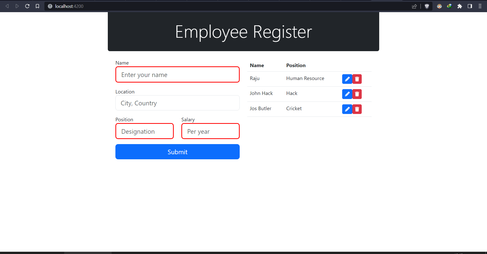
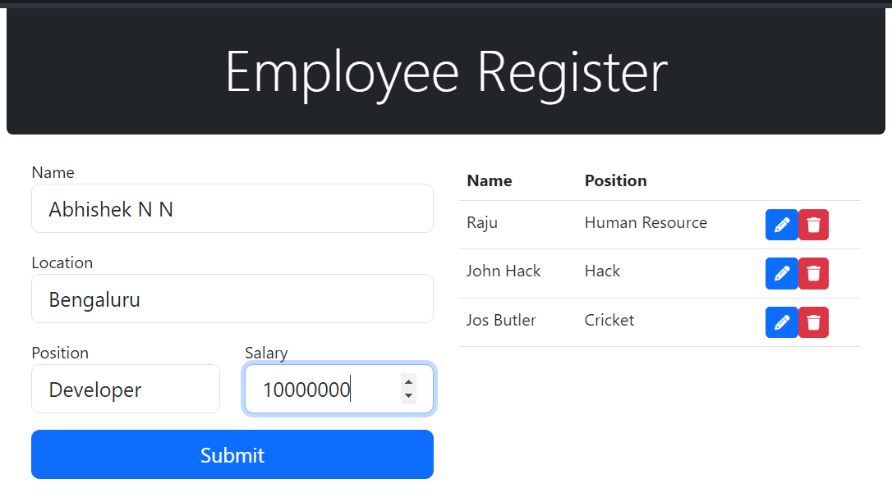
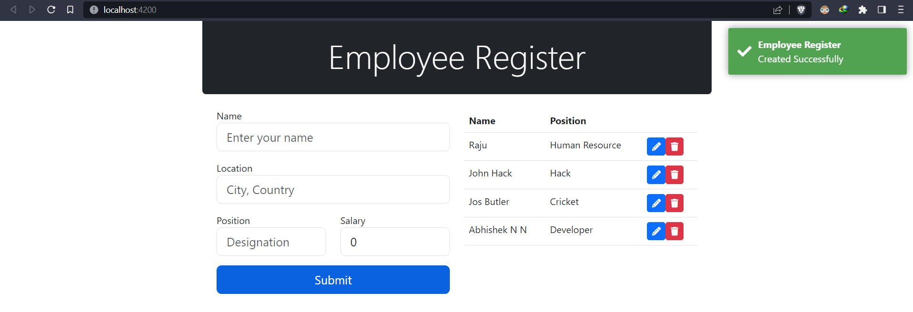
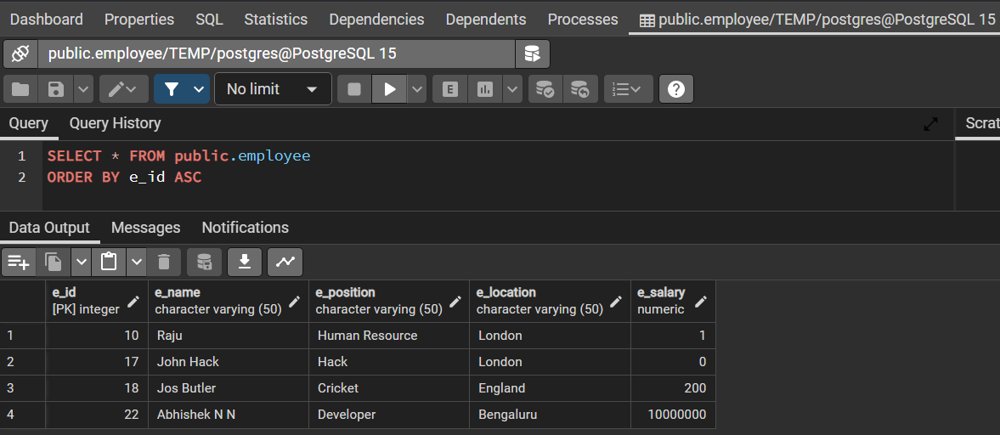
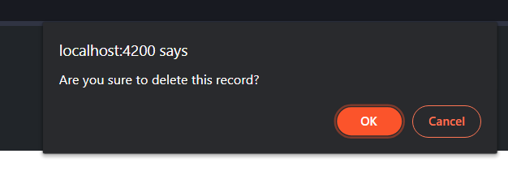
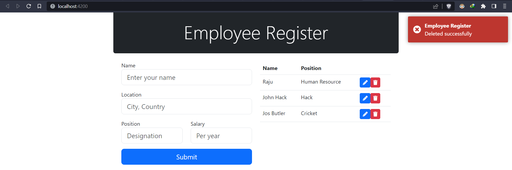
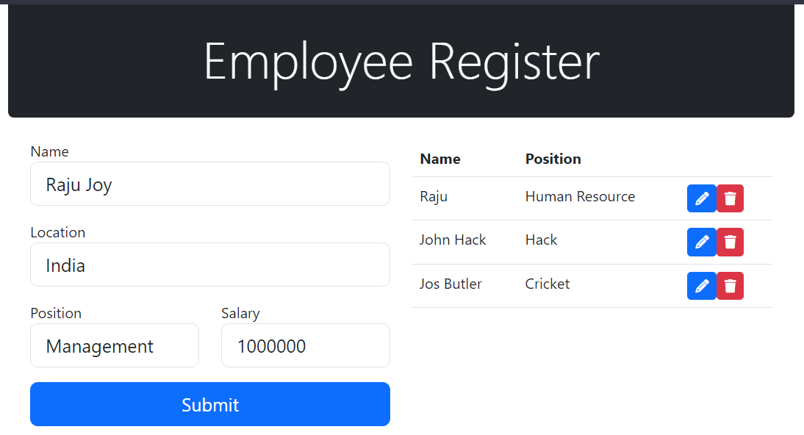
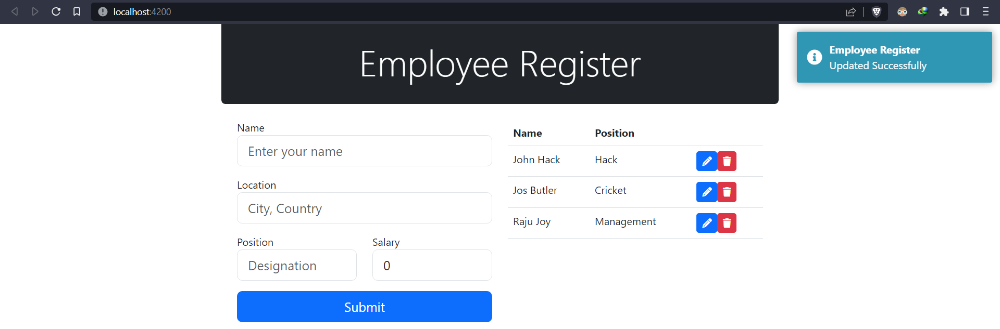

<h2>CRUD operation on Employee details by PEAN (PostgreSQL, Express.js, Angular, Node.js) stack </h2>
 
<h2>Screenshots</h2>

<h3>Homepage to get all employee details and input validataion when given invalid input</h3>

 
<h3>Giving Input</h3>

 
<h3>Inserting into database and success message</h3>

 
<h3>Database inserted status</h3>

 
<h3>JS popup confirmation for deleting</h3>

 
<h3>Employee Delete Success Full</h3>

 
<h3>Lets Modify Raju to Raju Joy and assign him to management</h3>

 
<h3>Modification Succesful</h3>

